# Potential Commanders

All Legendary Creatures and Legendary Spacecraft (Station mechanic) in your collection — **31 cards**.

---

## White

| Card | Name | Type | Precon |
|------|------|------|--------|
| 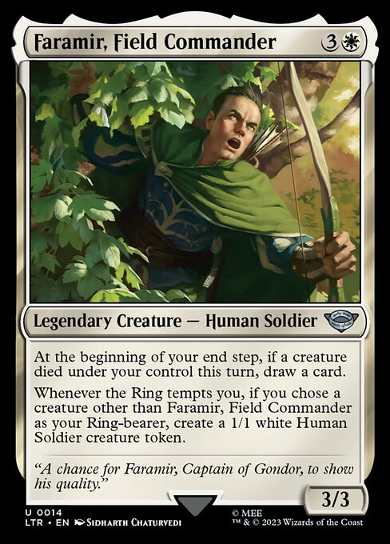 | **Faramir, Field Commander** | Legendary Creature — Human Soldier |  |
| 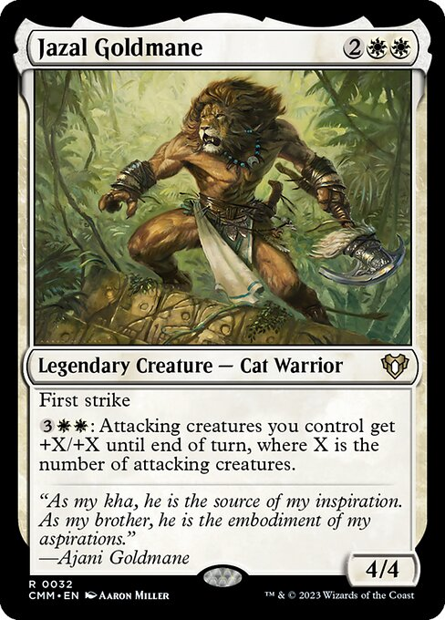 | **Jazal Goldmane** | Legendary Creature — Cat Warrior | Foundations BeginnerBox |
| 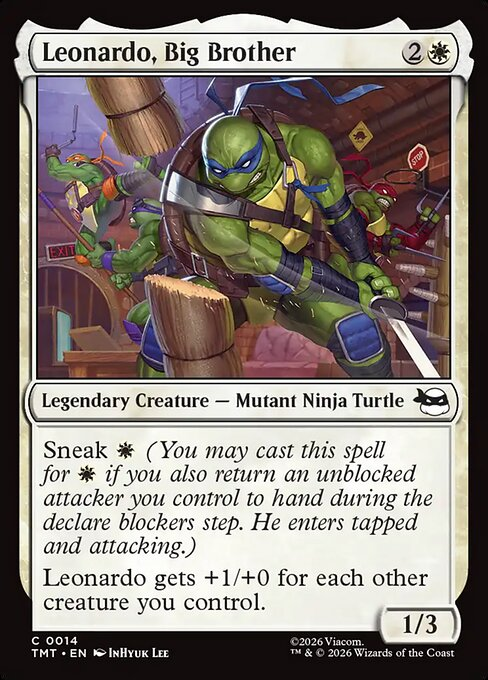 | **Leonardo, Big Brother** | Legendary Creature — Mutant Ninja Turtle |  |

## Blue

| Card | Name | Type | Precon |
|------|------|------|--------|
| 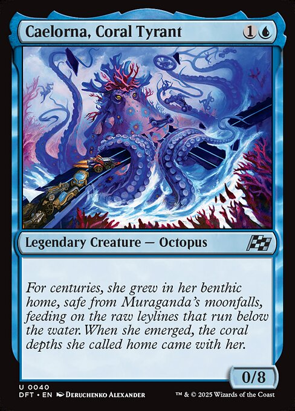 | **Caelorna, Coral Tyrant** | Legendary Creature — Octopus |  |
| 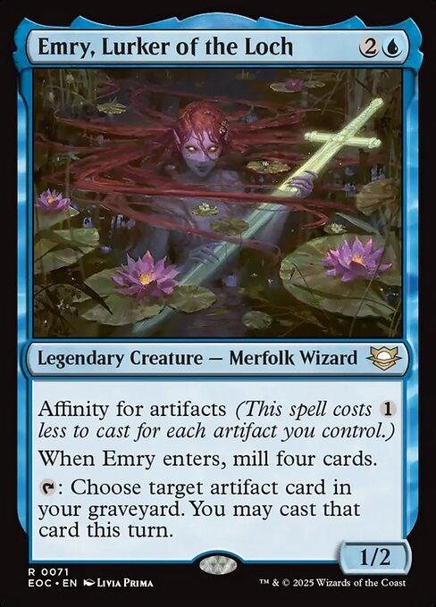 | **Emry, Lurker of the Loch** | Legendary Creature — Merfolk Wizard | CounterIntelligence |
| 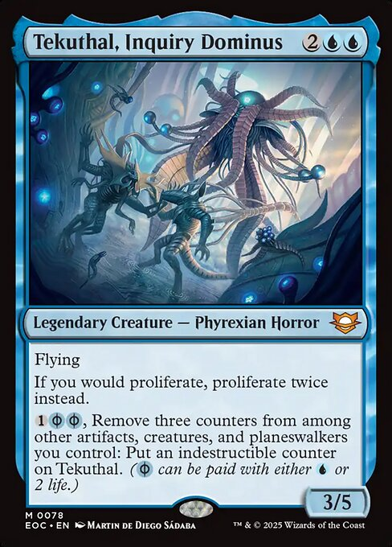 | **Tekuthal, Inquiry Dominus** | Legendary Creature — Phyrexian Horror | CounterIntelligence |

## Black

| Card | Name | Type | Precon |
|------|------|------|--------|
| 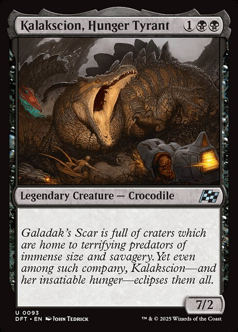 | **Kalakscion, Hunger Tyrant** | Legendary Creature — Crocodile |  |

## Red

| Card | Name | Type | Precon |
|------|------|------|--------|
| 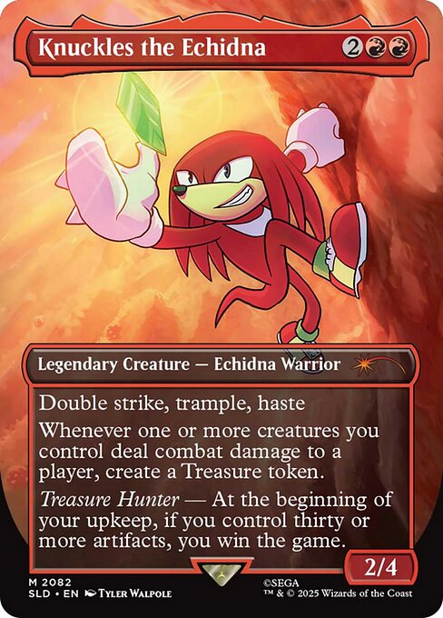 | **Knuckles the Echidna** | Legendary Creature — Echidna Warrior | SonictheHedgehog FriendsandFoes |
| 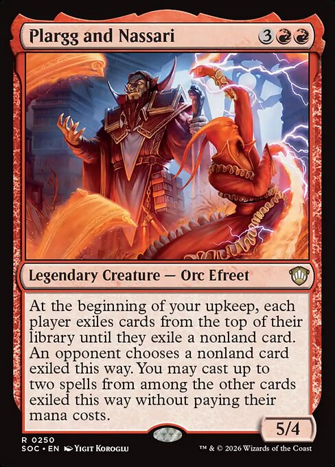 | **Plargg and Nassari** | Legendary Creature — Orc Efreet | PrismariArtistry |
| 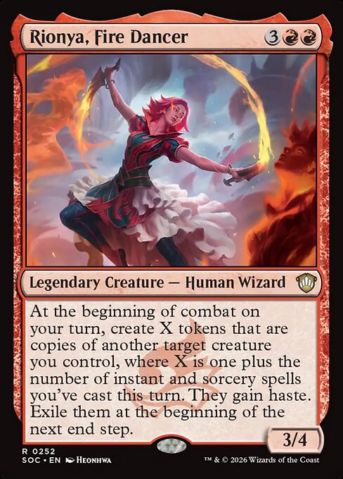 | **Rionya, Fire Dancer** | Legendary Creature — Human Wizard | PrismariArtistry |

## Green

| Card | Name | Type | Precon |
|------|------|------|--------|
| 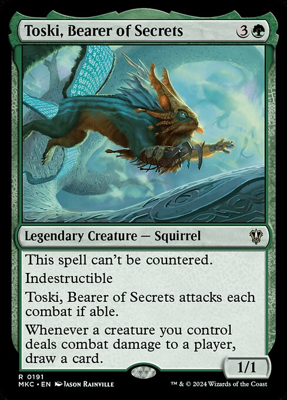 | **Toski, Bearer of Secrets** | Legendary Creature — Squirrel | SquirreledAway |

## Black, Green

| Card | Name | Type | Precon |
|------|------|------|--------|
| 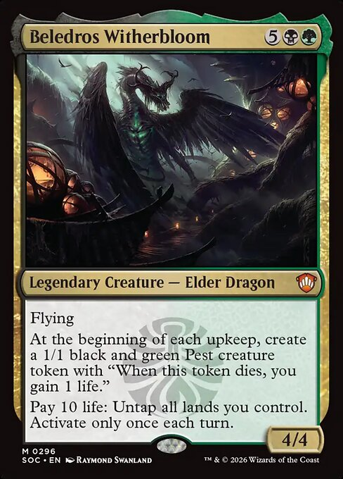 | **Beledros Witherbloom** | Legendary Creature — Elder Dragon | SquirreledAway |
| 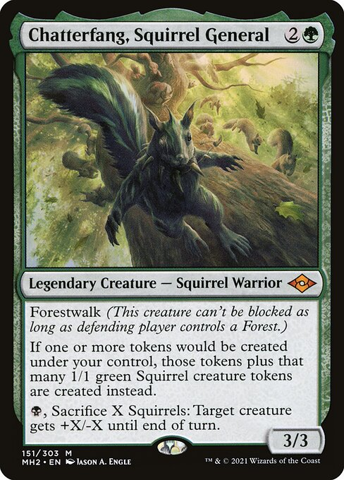 | **Chatterfang, Squirrel General** | Legendary Creature — Squirrel Warrior | SquirreledAway |
| 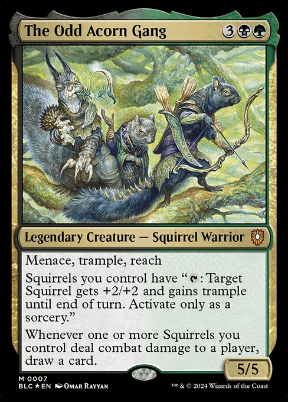 | **The Odd Acorn Gang** | Legendary Creature — Squirrel Warrior | SquirreledAway |

## Black, Red, Blue

| Card | Name | Type | Precon |
|------|------|------|--------|
| 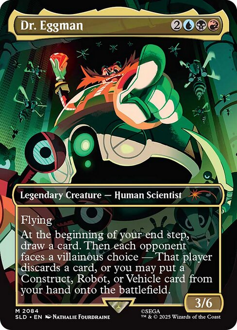 | **Dr. Eggman** | Legendary Creature — Human Scientist | SonictheHedgehog FriendsandFoes |

## Blue, White

| Card | Name | Type | Precon |
|------|------|------|--------|
| 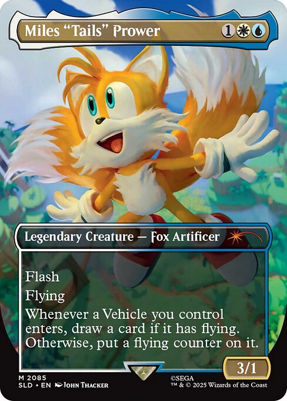 | **Miles "Tails" Prower** | Legendary Creature — Fox Artificer | SonictheHedgehog FriendsandFoes |

## Green, Blue

| Card | Name | Type | Precon |
|------|------|------|--------|
| 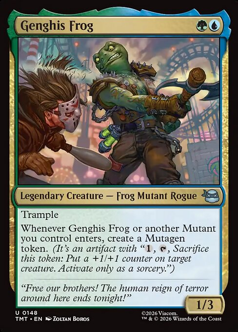 | **Genghis Frog** | Legendary Creature — Frog Mutant Rogue |  |

## Green, White

| Card | Name | Type | Precon |
|------|------|------|--------|
| 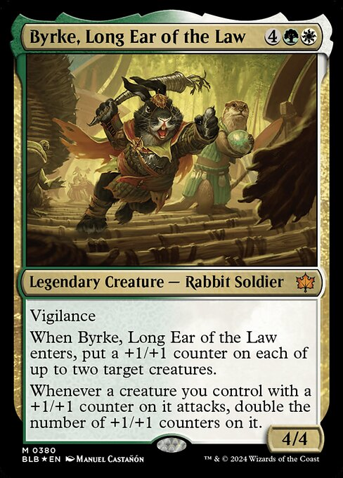 | **Byrke, Long Ear of the Law** | Legendary Creature — Rabbit Soldier | HareRaising |
| 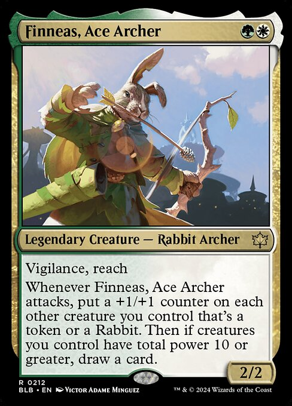 | **Finneas, Ace Archer** | Legendary Creature — Rabbit Archer | HareRaising |

## Red, Blue

| Card | Name | Type | Precon |
|------|------|------|--------|
| 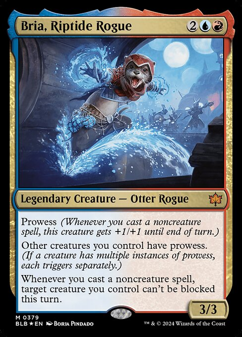 | **Bria, Riptide Rogue** | Legendary Creature — Otter Rogue | OtterLimits |
| 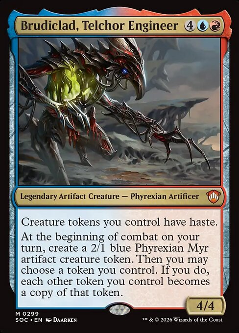 | **Brudiclad, Telchor Engineer** | Legendary Artifact Creature — Phyrexian Artificer | PrismariArtistry |
| 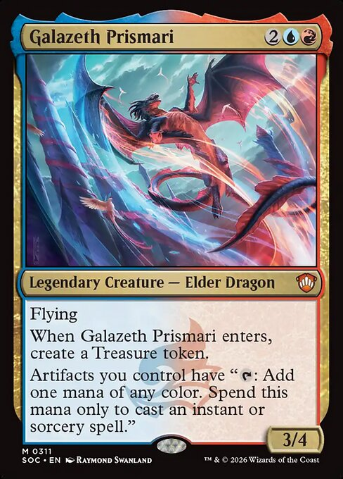 | **Galazeth Prismari** | Legendary Creature — Elder Dragon | PrismariArtistry |
| 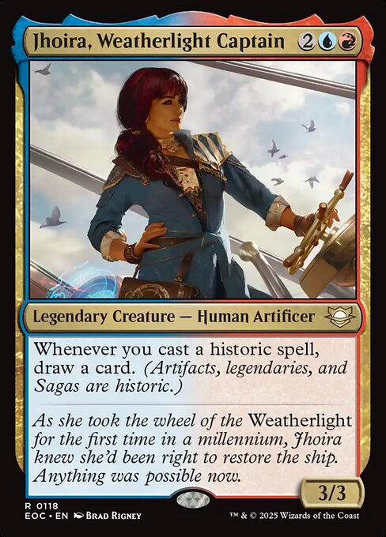 | **Jhoira, Weatherlight Captain** | Legendary Creature — Human Artificer | CounterIntelligence |
| 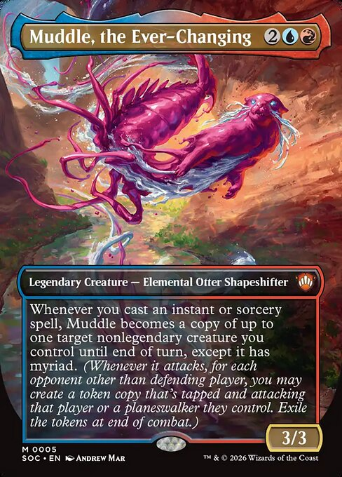 | **Muddle, the Ever-Changing** | Legendary Creature — Elemental Otter Shapeshifter | PrismariArtistry |
| 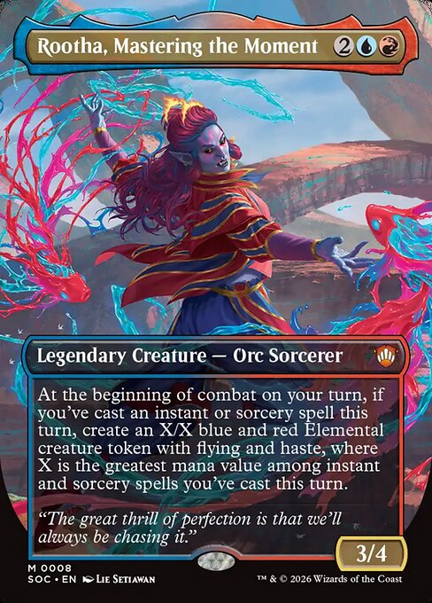 | **Rootha, Mastering the Moment** | Legendary Creature — Orc Sorcerer | PrismariArtistry |
| 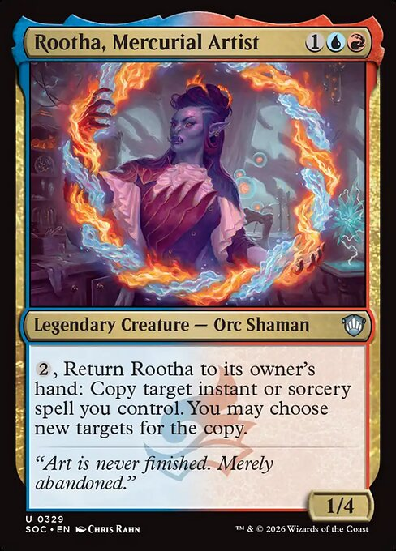 | **Rootha, Mercurial Artist** | Legendary Creature — Orc Shaman | PrismariArtistry |
| 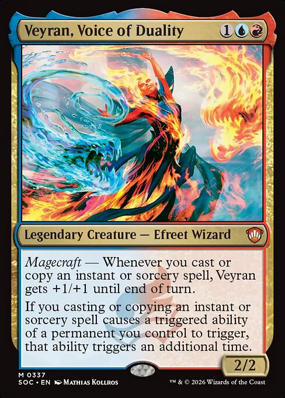 | **Veyran, Voice of Duality** | Legendary Creature — Efreet Wizard | PrismariArtistry |

## Red, Blue, White

| Card | Name | Type | Precon |
|------|------|------|--------|
| 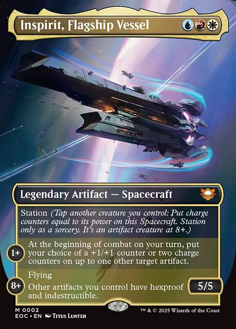 | **Inspirit, Flagship Vessel** | Legendary Artifact — Spacecraft | CounterIntelligence |
| 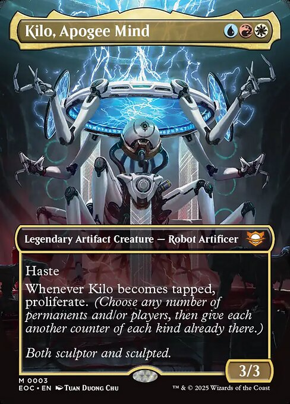 | **Kilo, Apogee Mind** | Legendary Artifact Creature — Robot Artificer | CounterIntelligence |
| 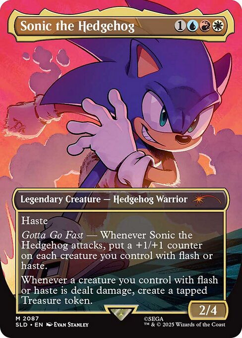 | **Sonic the Hedgehog** | Legendary Creature — Hedgehog Warrior | SonictheHedgehog FriendsandFoes |

## Red, White

| Card | Name | Type | Precon |
|------|------|------|--------|
| 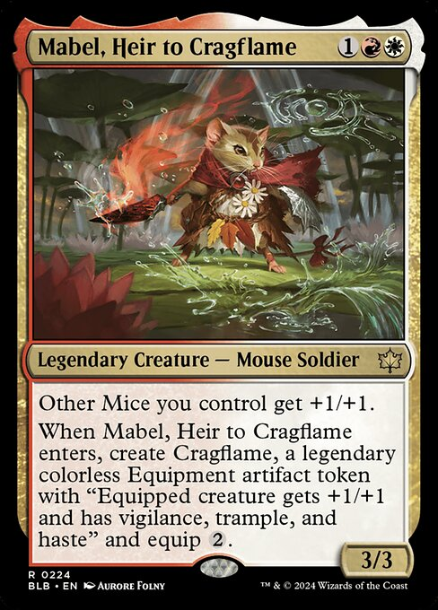 | **Mabel, Heir to Cragflame** | Legendary Creature — Mouse Soldier |  |

