# Potential Commanders

All Legendary Creatures and Legendary Spacecraft (Station mechanic) in your collection — **78 cards**.

---

## White

| Card | Name | Type | Precon |
|------|------|------|--------|
| 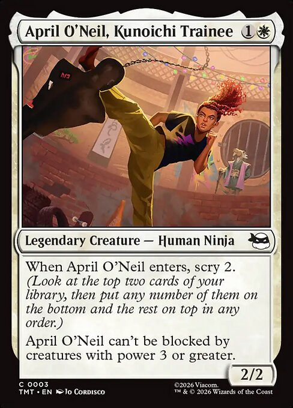 | **April O'Neil, Kunoichi Trainee** | Legendary Creature — Human Ninja |  |
| 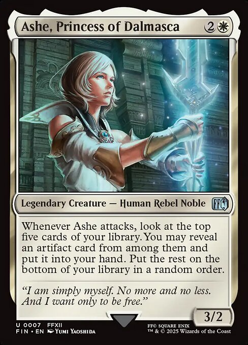 | **Ashe, Princess of Dalmasca** | Legendary Creature — Human Rebel Noble |  |
|  | **Faramir, Field Commander** | Legendary Creature — Human Soldier |  |
|  | **Jazal Goldmane** | Legendary Creature — Cat Warrior | Foundations BeginnerBox |
| 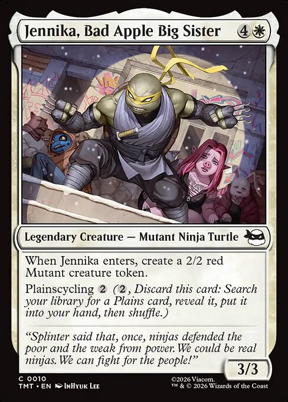 | **Jennika, Bad Apple Big Sister** | Legendary Creature — Mutant Ninja Turtle |  |
|  | **Leonardo, Big Brother** | Legendary Creature — Mutant Ninja Turtle |  |
| 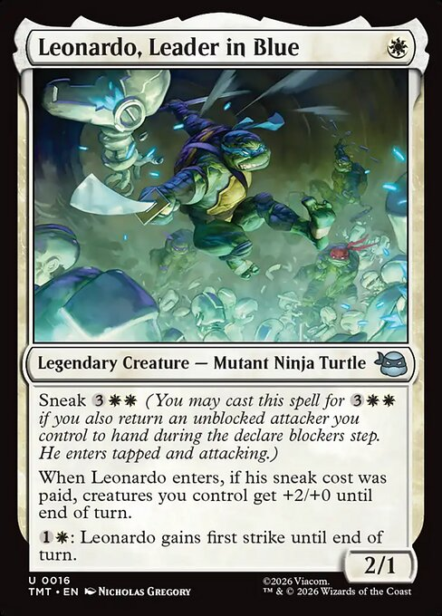 | **Leonardo, Leader in Blue** | Legendary Creature — Mutant Ninja Turtle |  |
| 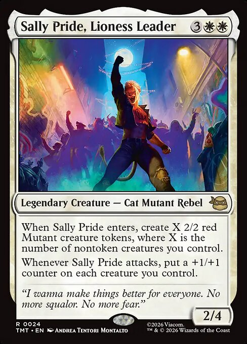 | **Sally Pride, Lioness Leader** | Legendary Creature — Cat Mutant Rebel |  |
| 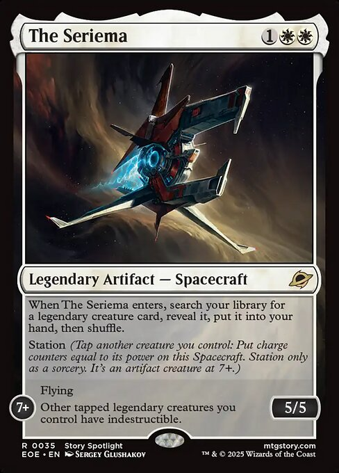 | **The Seriema** | Legendary Artifact — Spacecraft |  |

## Blue

| Card | Name | Type | Precon |
|------|------|------|--------|
| 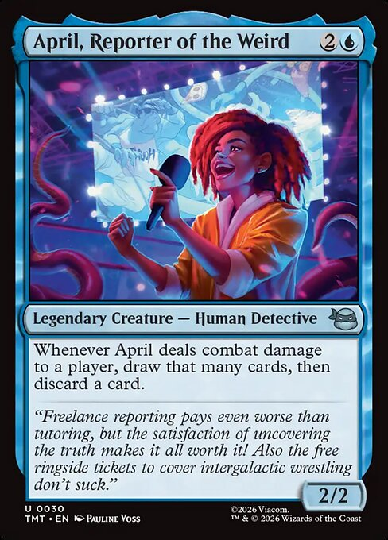 | **April, Reporter of the Weird** | Legendary Creature — Human Detective |  |
|  | **Caelorna, Coral Tyrant** | Legendary Creature — Octopus |  |
| 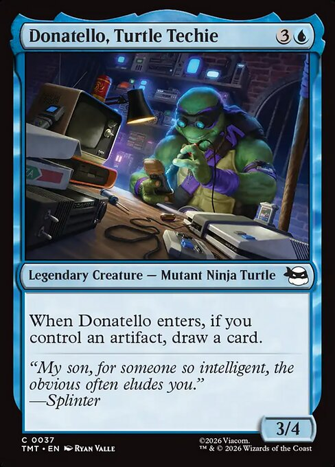 | **Donatello, Turtle Techie** | Legendary Creature — Mutant Ninja Turtle |  |
|  | **Emry, Lurker of the Loch** | Legendary Creature — Merfolk Wizard | CounterIntelligence |
| 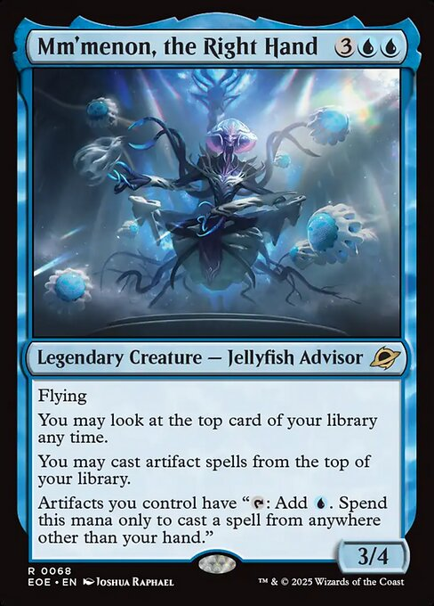 | **Mm'menon, the Right Hand** | Legendary Creature — Jellyfish Advisor |  |
| 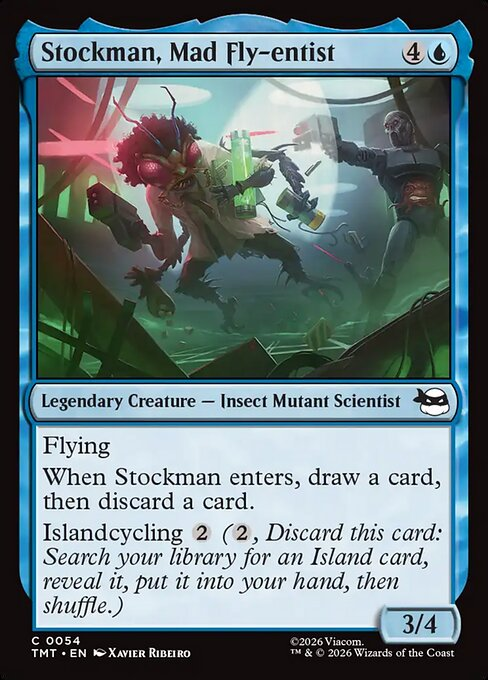 | **Stockman, Mad Fly-entist** | Legendary Creature — Insect Mutant Scientist |  |
|  | **Tekuthal, Inquiry Dominus** | Legendary Creature — Phyrexian Horror | CounterIntelligence |

## Black

| Card | Name | Type | Precon |
|------|------|------|--------|
| 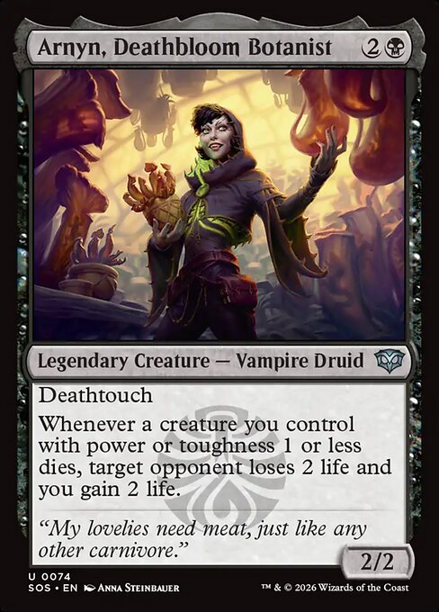 | **Arnyn, Deathbloom Botanist** | Legendary Creature — Vampire Druid |  |
| 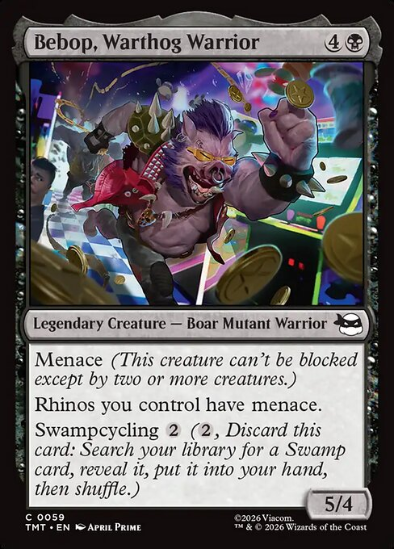 | **Bebop, Warthog Warrior** | Legendary Creature — Boar Mutant Warrior |  |
|  | **Kalakscion, Hunger Tyrant** | Legendary Creature — Crocodile |  |
| 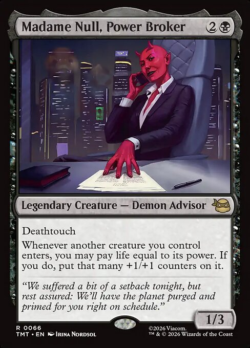 | **Madame Null, Power Broker** | Legendary Creature — Demon Advisor |  |
| 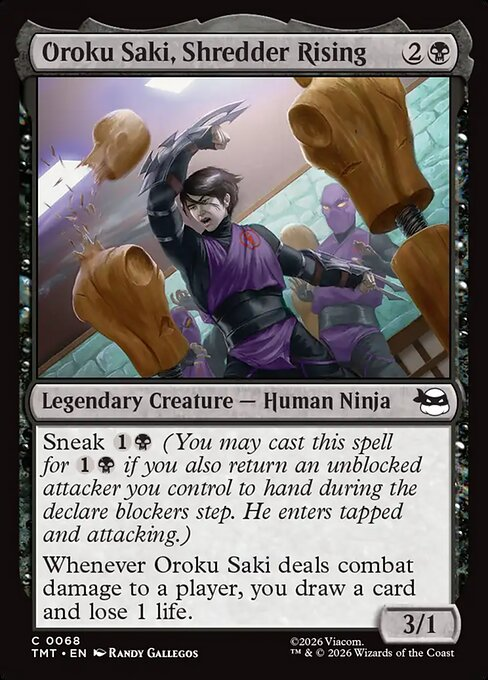 | **Oroku Saki, Shredder Rising** | Legendary Creature — Human Ninja |  |
| 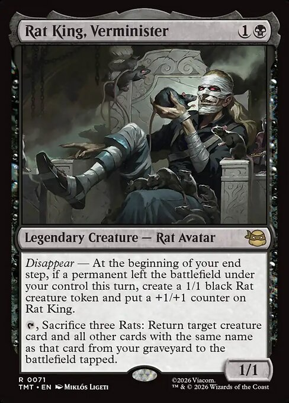 | **Rat King, Verminister** | Legendary Creature — Rat Avatar |  |
| 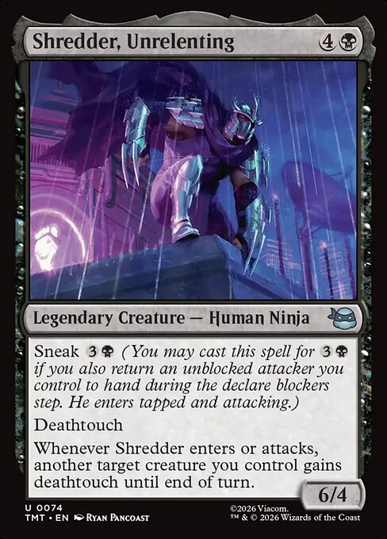 | **Shredder, Unrelenting** | Legendary Creature — Human Ninja |  |
| 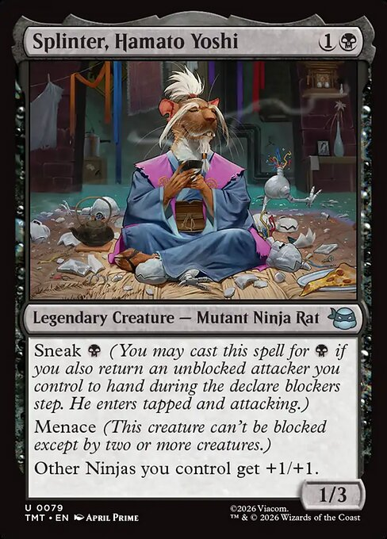 | **Splinter, Hamato Yoshi** | Legendary Creature — Mutant Ninja Rat |  |

## Red

| Card | Name | Type | Precon |
|------|------|------|--------|
| 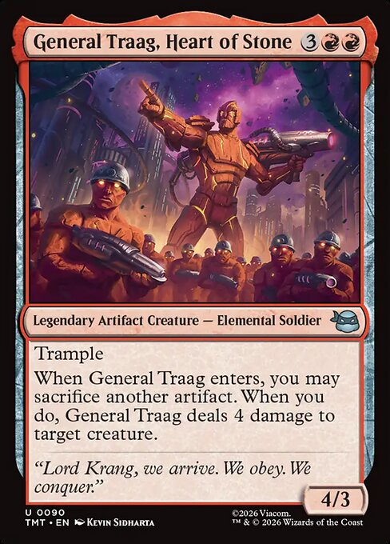 | **General Traag, Heart of Stone** | Legendary Artifact Creature — Elemental Soldier |  |
|  | **Knuckles the Echidna** | Legendary Creature — Echidna Warrior | SonictheHedgehog FriendsandFoes |
|  | **Plargg and Nassari** | Legendary Creature — Orc Efreet | PrismariArtistry |
| 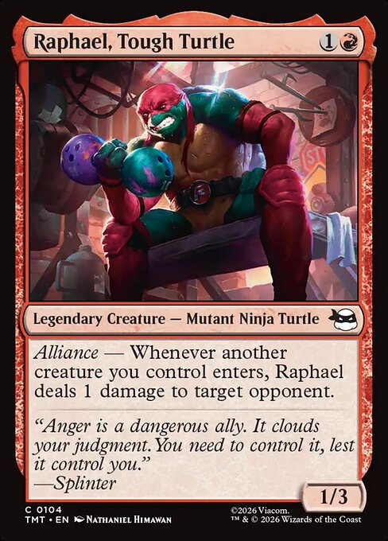 | **Raphael, Tough Turtle** | Legendary Creature — Mutant Ninja Turtle |  |
|  | **Rionya, Fire Dancer** | Legendary Creature — Human Wizard | PrismariArtistry |
| 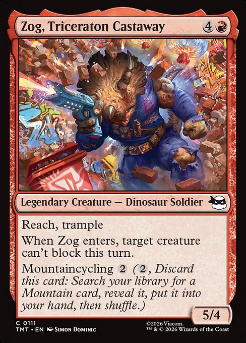 | **Zog, Triceraton Castaway** | Legendary Creature — Dinosaur Soldier |  |

## Green

| Card | Name | Type | Precon |
|------|------|------|--------|
| 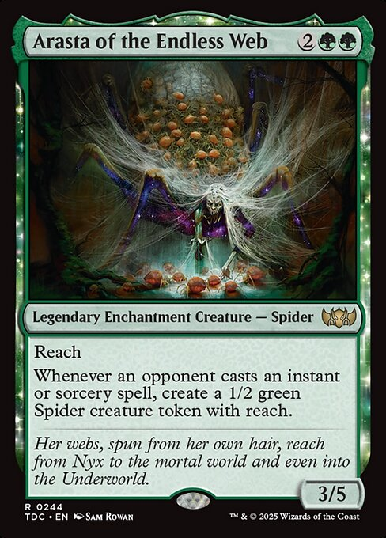 | **Arasta of the Endless Web** | Legendary Enchantment Creature — Spider | SquirreledAway |
| 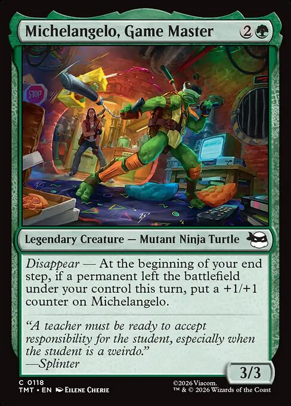 | **Michelangelo, Game Master** | Legendary Creature — Mutant Ninja Turtle |  |
| 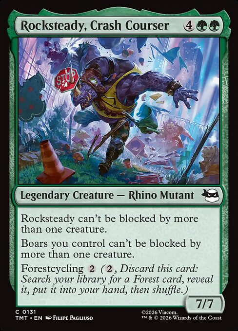 | **Rocksteady, Crash Courser** | Legendary Creature — Rhino Mutant |  |
|  | **Toski, Bearer of Secrets** | Legendary Creature — Squirrel | SquirreledAway |
| 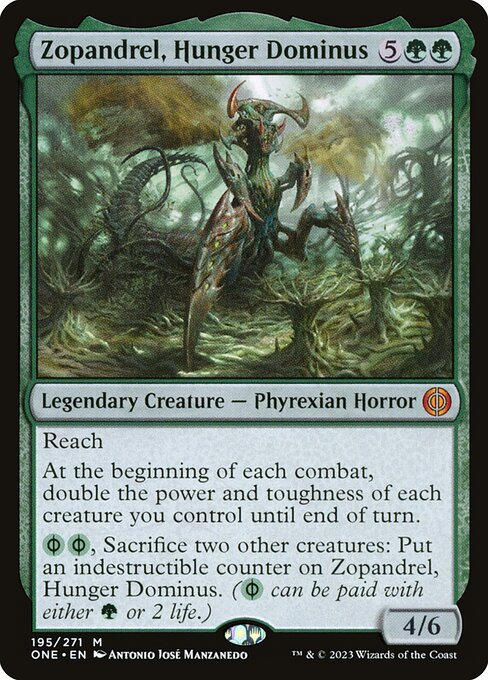 | **Zopandrel, Hunger Dominus** | Legendary Creature — Phyrexian Horror |  |

## Black, Red

| Card | Name | Type | Precon |
|------|------|------|--------|
| 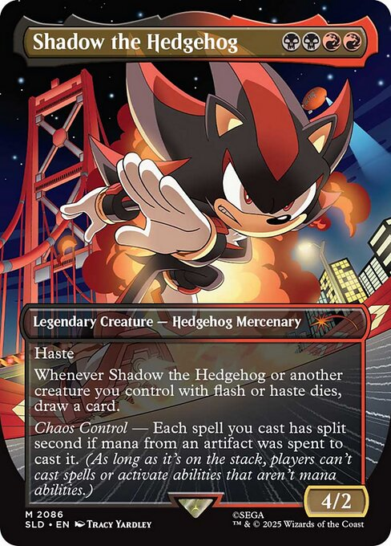 | **Shadow the Hedgehog** | Legendary Creature — Hedgehog Mercenary | SonictheHedgehog FriendsandFoes |

## Black, Green

| Card | Name | Type | Precon |
|------|------|------|--------|
|  | **Beledros Witherbloom** | Legendary Creature — Elder Dragon | SquirreledAway |
|  | **Chatterfang, Squirrel General** | Legendary Creature — Squirrel Warrior | SquirreledAway |
| 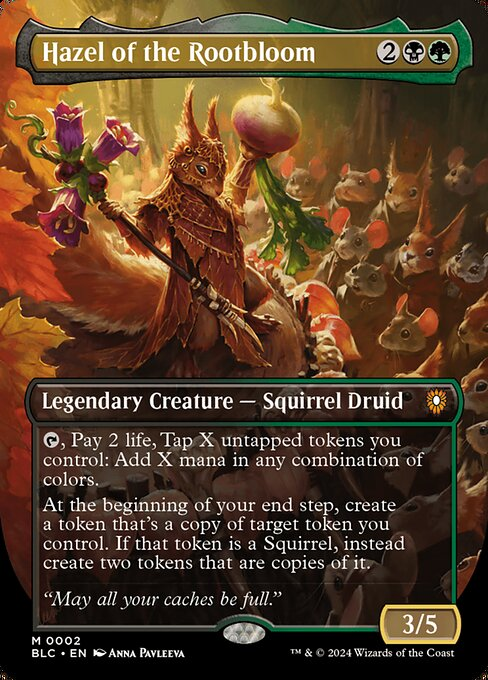 | **Hazel of the Rootbloom** | Legendary Creature — Squirrel Druid | SquirreledAway |
| 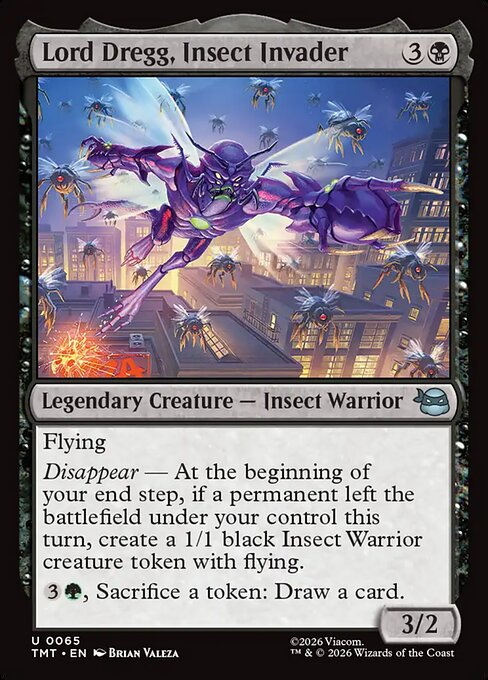 | **Lord Dregg, Insect Invader** | Legendary Creature — Insect Warrior |  |
|  | **The Odd Acorn Gang** | Legendary Creature — Squirrel Warrior | SquirreledAway |

## Black, Blue

| Card | Name | Type | Precon |
|------|------|------|--------|
| 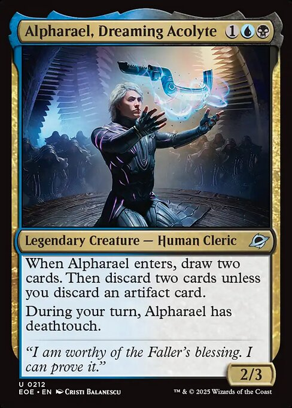 | **Alpharael, Dreaming Acolyte** | Legendary Creature — Human Cleric |  |

## Black, Blue, White

| Card | Name | Type | Precon |
|------|------|------|--------|
| 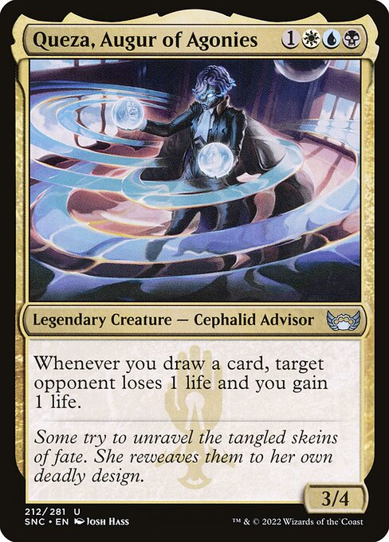 | **Queza, Augur of Agonies** | Legendary Creature — Octopus Advisor |  |

## Black, Green, Red, Blue, White

| Card | Name | Type | Precon |
|------|------|------|--------|
| 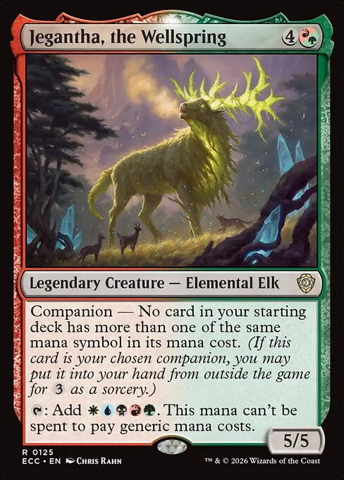 | **Jegantha, the Wellspring** | Legendary Creature — Elemental Elk |  |

## Black, Red, Blue

| Card | Name | Type | Precon |
|------|------|------|--------|
|  | **Dr. Eggman** | Legendary Creature — Human Scientist | SonictheHedgehog FriendsandFoes |

## Black, White

| Card | Name | Type | Precon |
|------|------|------|--------|
| 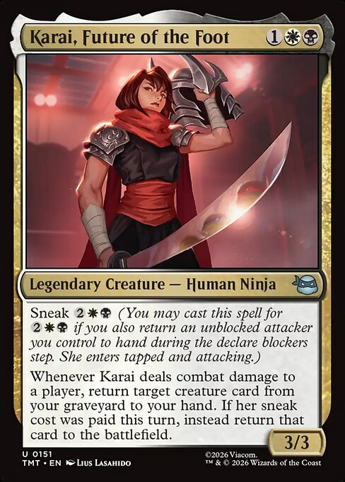 | **Karai, Future of the Foot** | Legendary Creature — Human Ninja |  |
| 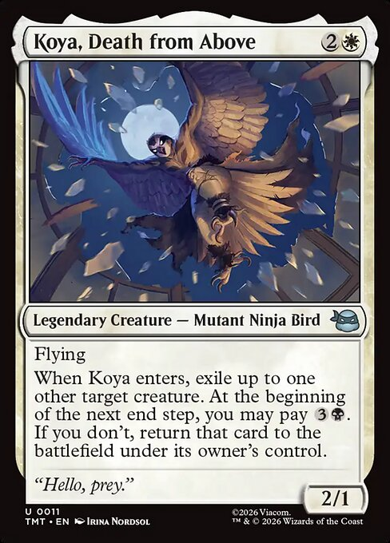 | **Koya, Death from Above** | Legendary Creature — Mutant Ninja Bird |  |

## Blue, White

| Card | Name | Type | Precon |
|------|------|------|--------|
|  | **Miles "Tails" Prower** | Legendary Creature — Fox Artificer | SonictheHedgehog FriendsandFoes |

## Green, Blue

| Card | Name | Type | Precon |
|------|------|------|--------|
| 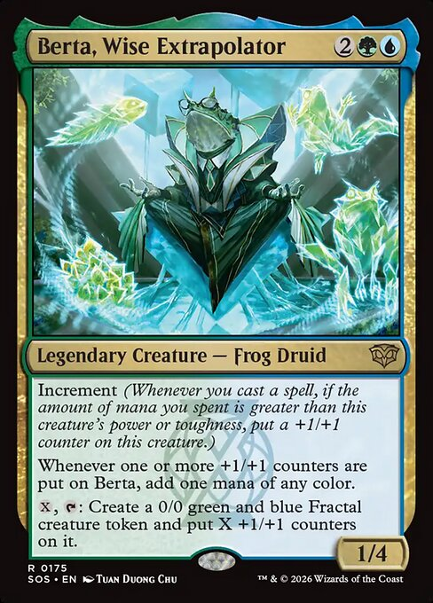 | **Berta, Wise Extrapolator** | Legendary Creature — Frog Druid |  |
|  | **Genghis Frog** | Legendary Creature — Frog Mutant Rogue |  |
| 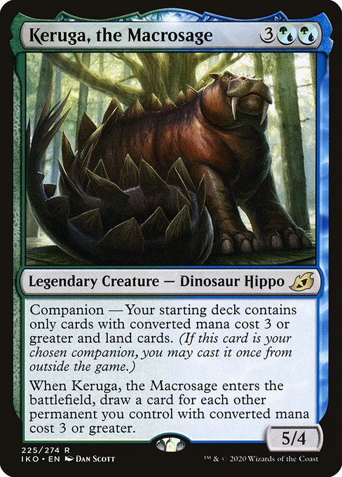 | **Keruga, the Macrosage** | Legendary Creature — Dinosaur Hippo |  |

## Green, Blue, White

| Card | Name | Type | Precon |
|------|------|------|--------|
| 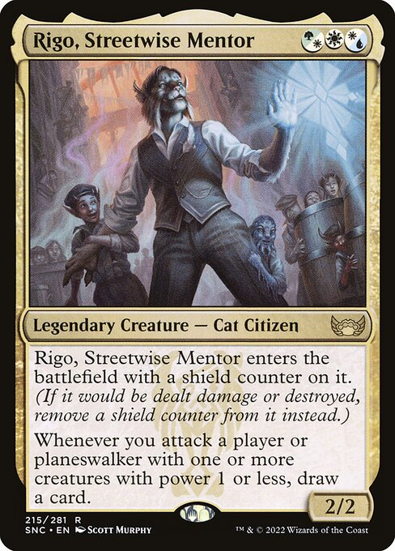 | **Rigo, Streetwise Mentor** | Legendary Creature — Cat Citizen |  |

## Green, Red

| Card | Name | Type | Precon |
|------|------|------|--------|
| 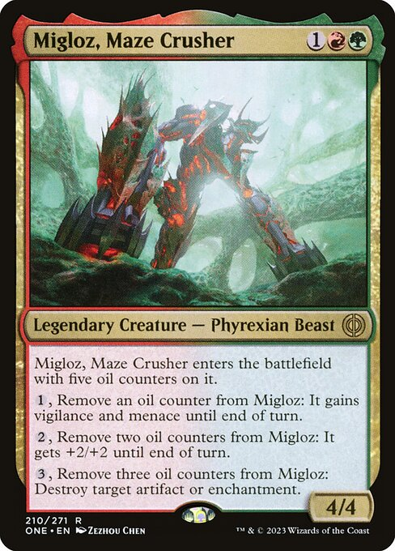 | **Migloz, Maze Crusher** | Legendary Creature — Phyrexian Beast |  |
| 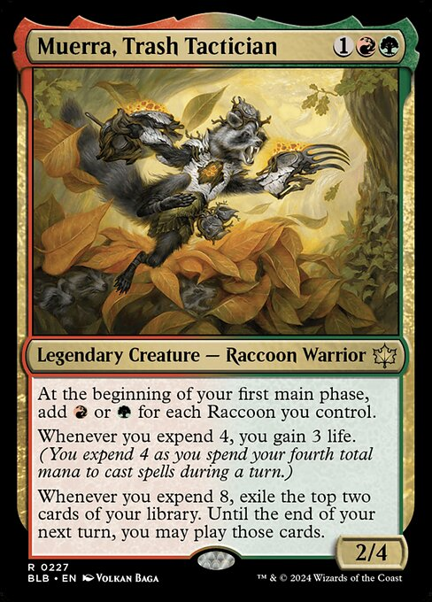 | **Muerra, Trash Tactician** | Legendary Creature — Raccoon Warrior |  |

## Green, White

| Card | Name | Type | Precon |
|------|------|------|--------|
|  | **Byrke, Long Ear of the Law** | Legendary Creature — Rabbit Soldier | HareRaising |
|  | **Finneas, Ace Archer** | Legendary Creature — Rabbit Archer | HareRaising |

## Red, Blue

| Card | Name | Type | Precon |
|------|------|------|--------|
| 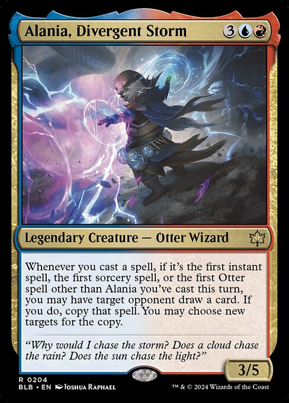 | **Alania, Divergent Storm** | Legendary Creature — Otter Wizard | OtterLimits |
|  | **Bria, Riptide Rogue** | Legendary Creature — Otter Rogue | OtterLimits |
|  | **Brudiclad, Telchor Engineer** | Legendary Artifact Creature — Phyrexian Artificer | PrismariArtistry |
| 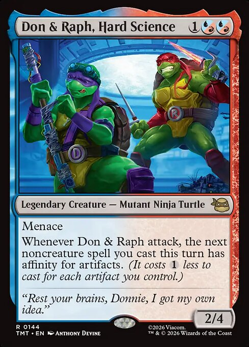 | **Don & Raph, Hard Science** | Legendary Creature — Mutant Ninja Turtle |  |
|  | **Galazeth Prismari** | Legendary Creature — Elder Dragon | PrismariArtistry |
|  | **Jhoira, Weatherlight Captain** | Legendary Creature — Human Artificer | CounterIntelligence |
| 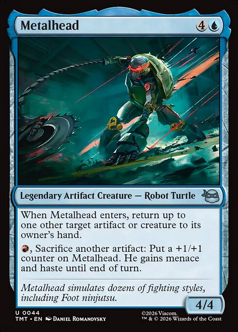 | **Metalhead** | Legendary Artifact Creature — Robot Turtle |  |
|  | **Muddle, the Ever-Changing** | Legendary Creature — Elemental Otter Shapeshifter | PrismariArtistry |
|  | **Rootha, Mastering the Moment** | Legendary Creature — Orc Sorcerer | PrismariArtistry |
|  | **Rootha, Mercurial Artist** | Legendary Creature — Orc Shaman | PrismariArtistry |
|  | **Veyran, Voice of Duality** | Legendary Creature — Efreet Wizard | PrismariArtistry |
| 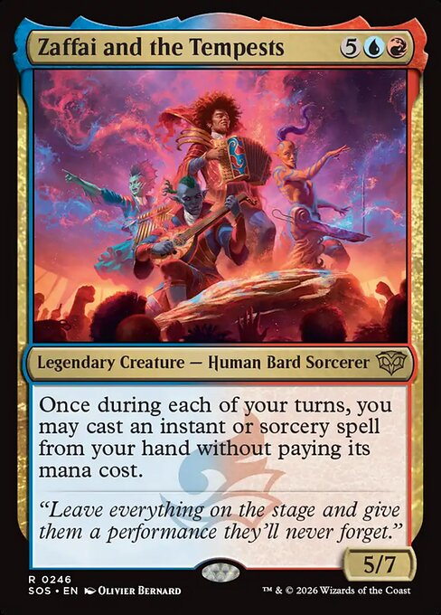 | **Zaffai and the Tempests** | Legendary Creature — Human Bard Sorcerer |  |

## Red, Blue, White

| Card | Name | Type | Precon |
|------|------|------|--------|
|  | **Inspirit, Flagship Vessel** | Legendary Artifact — Spacecraft | CounterIntelligence |
|  | **Kilo, Apogee Mind** | Legendary Artifact Creature — Robot Artificer | CounterIntelligence |
|  | **Sonic the Hedgehog** | Legendary Creature — Hedgehog Warrior | SonictheHedgehog FriendsandFoes |

## Red, White

| Card | Name | Type | Precon |
|------|------|------|--------|
| 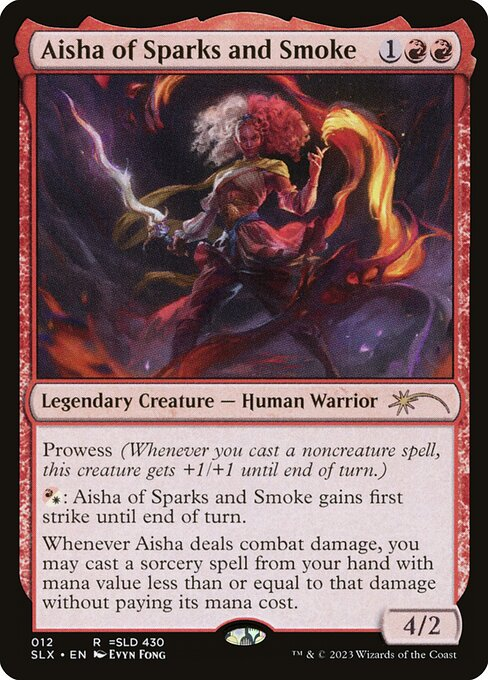 | **Aisha of Sparks and Smoke** | Legendary Creature — Human Warrior |  |
| 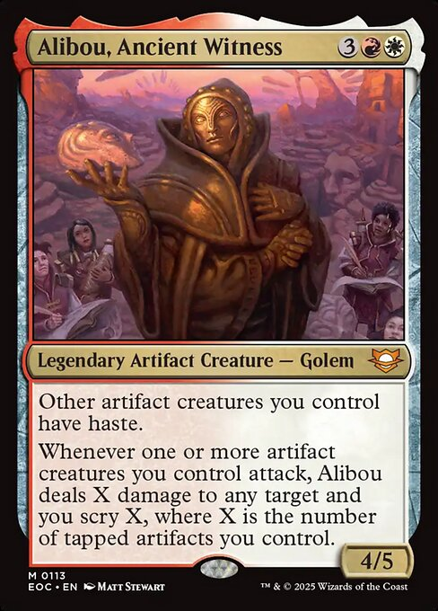 | **Alibou, Ancient Witness** | Legendary Artifact Creature — Golem | CounterIntelligence |
| 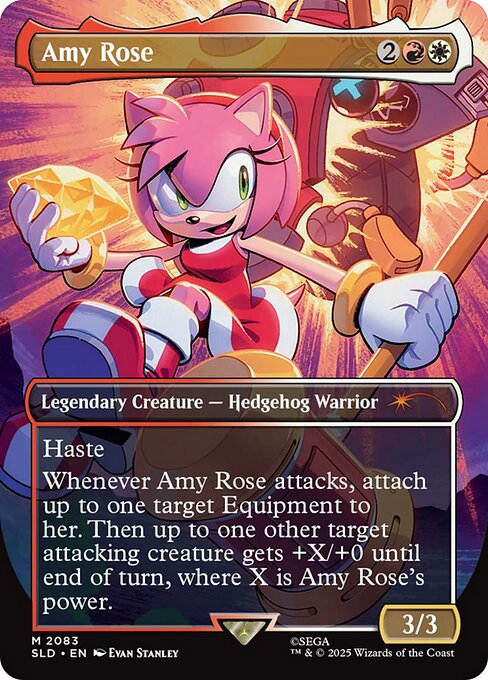 | **Amy Rose** | Legendary Creature — Hedgehog Warrior | SonictheHedgehog FriendsandFoes |
|  | **Mabel, Heir to Cragflame** | Legendary Creature — Mouse Soldier |  |
| 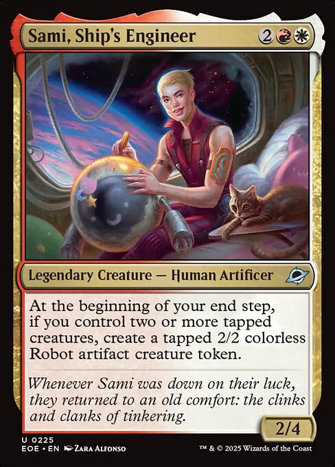 | **Sami, Ship's Engineer** | Legendary Creature — Human Artificer |  |
| 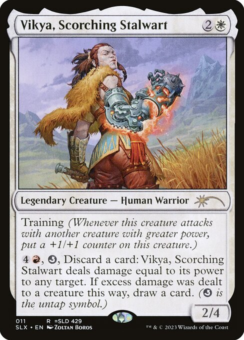 | **Vikya, Scorching Stalwart** | Legendary Creature — Human Warrior |  |
| 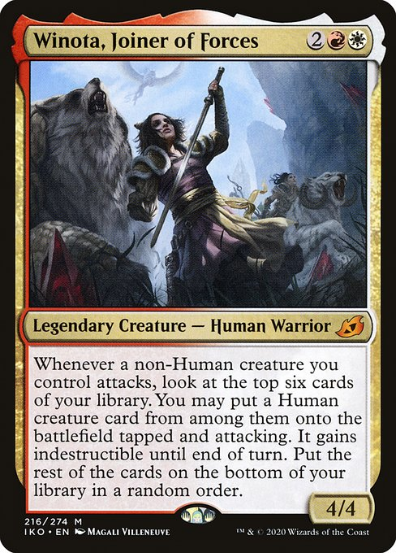 | **Winota, Joiner of Forces** | Legendary Creature — Human Warrior |  |

